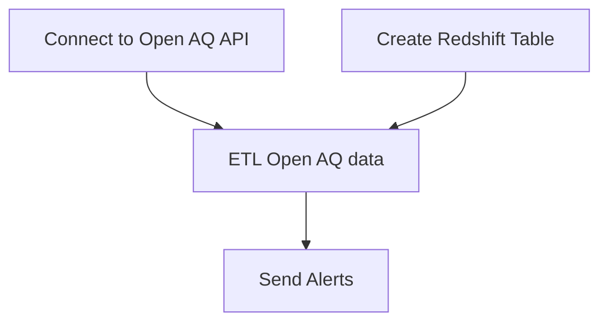

# Open Air Quality ETL

  

The objective of this code is to extract data from the OpenAQ (Open Air Quality) API.

This API provides data about air quality in at least 300k locations arround the world.

The data for each location is updated every day.

The parameters that define air quality are: pm1_µg/m³, pm25_µg/m³, pm10_µg/m³, pm10_µg/m³, no2_ppm, co_ppm, o3_ppm, so2_ppm, o3_µg/m³, co_µg/m³, nox_µg/m³, no_µg/m³, so2_µg/m³, no2_µg/m³.


This code generates a DataFrame with the following data: 'id', 'city', 'name', 'entity', 'country', 'sources', 'isMobile', 'isAnalysis', 'parameters', 'sensorType', 'lastUpdated', 'firstUpdated', 'measurements', 'bounds', 'manufacturers', 'coordinates.latitude', 'coordinates.longitude'. The data is uploaded to Redshift

The code runs in a Airflow DAG, and Airflow runs inside a Docker container.
  

## How to start the project

- Clone the repository

- Start the terminal and go to the ./airflow-docker folder
- Create a variables.json file with your Redshift credentials and your Open AQ API key, among other parameters (see below)
- Modify the docker-compose.yml with the context directory for building the etl container (line 104). It should look into the root folder.

- Start the project with `docker-compose up --build`. Make sure that the Docker daemon is already running before shooting the command. It will install all the dependencies of the project from the requirements.txt file.

- Go to your localhost:8080/home in your browser and check the DAGs.
- The DAG includes 4 tasks: 


- Generate the following variables with their corresponding values using a variable.json file and importing it into Airflow (see model below)
  
  - "apikey_openaq"
  - "redshift_db"
  - "redshift_db_user"
  - "redshift_host"
  - "secret_redshift_db_pass"
  - "smtp_password"
  - "high_threshold"
  - "low_threshold"
  - "filter_parameter"
- The parameters that can be selected are the following:
  - pm25_µg/m³, 
  - no2_ppm, 
  - pm10_µg/m³, 
  - co_ppm, 
  - co_µg/m³, 
  - nox_µg/m³, 
  - no_µg/m³, 
  - no2_µg/m³, 
  - o3_µg/m³, 
  - so2_µg/m³, 
  - o3_ppm,
  - pm1_µg/m³, 
  - no_ppm, 
  - so2_ppm, 
  - nox_ppm, 
  - bc_µg/m³
- The high and low threshold must be selected according to the parameter. For more information, check the [Open AQ documentation](https://docs.openaq.org/docs/parameters)

### Variables

Use the following model to create your 'variables.json' file

```json
{
    "apikey_openaq": "apikey_openaq",
    "high_threshold": 100,
    "low_threshold": 0,
    "filter_parameter": "filter_parameter",
    "redshift_db": "redshift_db",
    "redshift_db_user": "redshift_db_user",
    "redshift_host": "example-cluster.xdxswr5sda.us-east-1.redshift.amazonaws.com",
    "secret_redshift_db_pass": "secret_redshift_db_pass",
    "smtp_password": "smtp_password"
}
```