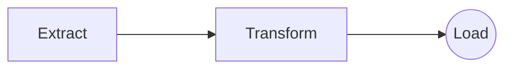

# Open Air Quality ETL

  

The objective of this code is to extract data from the OpenAQ (Open Air Quality) API.

This API provides data about air quality in at least 300k locations arround the world.

The data for each location is updated every day.

The parameters that define air quality are: um005_particles/cm³, um100_particles/cm³, temperature_c, pm1_µg/m³, pressure_mb, um003_particles/cm³_avg, pm25_µg/m³, humidity_%_avg, um025_particles/cm³, pm10_µg/m³, pm10_µg/m³, um050_particles/cm³, temperature_f, um010_particles/cm³, no2_ppm, co_ppm, o3_ppm, so2_ppm, o3_µg/m³, voc_iaq, co_µg/m³, nox_µg/m³, no_µg/m³, so2_µg/m³, no2_µg/m³.

The API provides information about the average and the last value measured of each parameter. In the next iterations, the idea is to extract each of those parameters and write them in the final table inside Redshift

For the time being, this code generates a json with the following data: 'id', 'city', 'name', 'entity', 'country', 'sources', 'isMobile', 'isAnalysis', 'parameters', 'sensorType', 'lastUpdated', 'firstUpdated', 'measurements', 'bounds', 'manufacturers', 'coordinates.latitude', 'coordinates.longitude'.

The code runs in a Airflow DAG, and Airflow runs inside a Docker container.
  

## How to start the project

- Clone the repository

- Start the terminal and go to the ./airflow-docker folder
- Create a .env file with your Redshift credentials and your Open AQ API key.

- Start the project with `docker-compose --env-file=.env up --build`. Make sure that the Docker daemon is already running before shooting the command. It will install all the dependencies of the project from the requirements.txt file.

- Go to your localhost:8080/home in your browser and check the DAGs.
- The DAG includes currently a single task: etl_pipeline. Run the task. It will extract, transform and load the Open AQ data to your Amazon Redshift DB.

# Notes
The original idea was to run the extract, transform and loading in separate tasks in the DAG, like this:

But the communication between the tasks is only possible using XCom, and is not recommended to pass dataframes or a large amount of data between tasks [Link to Airflow documentation](https://airflow.apache.org/docs/apache-airflow/stable/core-concepts/xcoms.html).
